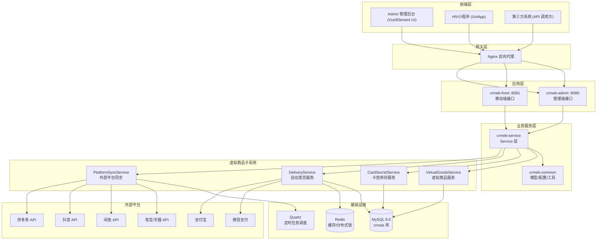
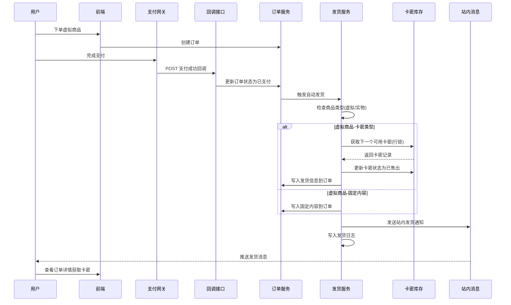

# 虚拟商品发货系统 - 技术设计文档

Feature Name: virtual-goods-delivery
Updated: 2026-07-29

## 描述

基于 CRMEB_Java v2.4 开源电商系统进行最小化二次开发，实现虚拟商品自动发货功能。改造策略遵循最小变更原则：保留原有电商核心能力（用户、订单、支付、商品管理等），仅替换品牌标识、移除升级/授权检测模块，并新增虚拟商品发货子系统。

## 架构



## 组件与接口

### 1. 品牌替换改造

#### 1.1 后端 Java 源码

涉及文件范围：`crmeb/` 目录下所有 `.java` 文件（约 500+ 个）

**改造内容：**

| 改造项 | 原内容 | 新内容 |
|--------|--------|--------|
| 文件头版权注释 | `CRMEB [ CRMEB赋能开发者... ]` 段落 | 移除或替换为全新版权声明 |
| 包路径前缀 | `com.zbkj.*` | 保持不变，仅替换注释内容 |
| 配置类名 | `CrmebConfig.java` | 重命名为 `AppConfig.java` |
| 配置属性前缀 | `crmeb.*` | 重命名为 `app.*` |
| 水印文字 | `application.yml` 中 `water-mark: CRMEB Java` | 替换为全新品牌水印 |
| 版本标识 | `crmeb.version: CRMEB-JAVA-SY-v2.4` | 替换为 `app.version: {NEW_VERSION}` |

**关键文件改造明细：**

| 文件 | 改动类型 | 说明 |
|------|---------|------|
| `crmeb-common/src/main/java/com/zbkj/common/config/CrmebConfig.java` | 重命名+修改 | 类名改为 AppConfig，属性前缀改为 app |
| `crmeb-admin/src/main/resources/application.yml` | 修改配置 | 替换 crmeb 相关配置项 |
| `crmeb-front/src/main/resources/application.yml` | 修改配置 | 同上 |
| 所有 `src/main/java/com/zbkj/**/*.java` | 替换注释 | 批量移除文件头 CRMEB 版权注释 |
| `crmeb-common/src/main/java/com/zbkj/common/constants/Constants.java` | 修改常量 | 移除 UPGRADE 相关常量 |

#### 1.2 前端 Admin (Vue)

| 文件 | 改动类型 | 说明 |
|------|---------|------|
| `admin/public/static/` 下所有资源 | 替换文件 | favicon、logo 图片资源 |
| `admin/src/layout/upgrade/` | **删除整个目录** | 版本升级弹窗组件 |
| `admin/src/` 下所有 `.vue` | 搜索替换 | 替换 `crmeb` 字符串为全新品牌名 |
| `admin/package.json` | 修改 | 替换 name、description 字段 |

#### 1.3 前端 App (UniApp)

| 文件 | 改动类型 | 说明 |
|------|---------|------|
| `app/manifest.json` | 修改 | name、description 替换 |
| `app/pages.json` | 修改 | navigationBarTitleText 替换 |
| `app/components/update/` | **删除整个目录** | App 端版本更新检测组件 |
| `app/pages/users/app_update/` | **删除整个目录** | 用户设置页检查新版本入口 |
| `app/pages/` 下所有 `.vue` | 搜索替换 | 替换 `crmeb` 字符串 |
| `app/static/` 下所有资源 | 替换文件 | 品牌相关图片资源 |

#### 1.4 数据库初始化脚本

文件：`crmeb/sql/Crmeb_v3.0.sql`（14670 行）

| 改造项 | 说明 |
|--------|------|
| 品牌相关初始数据 | 替换 `INSERT` 语句中涉及品牌名称的记录 |
| 默认账号密码 | 保留或修改为新的默认账号 |
| SQL 文件注释头 | 替换文件顶部的版权说明 |

#### 1.5 移除升级/授权检测模块

| 文件 | 改动类型 | 说明 |
|------|---------|------|
| `crmeb-admin/src/main/java/com/zbkj/admin/service/impl/CopyrightServiceImpl.java` | **删除整个文件** | 远程授权验证服务 |
| `admin/src/layout/upgrade/index.vue` | **删除整个文件** | 管理后台版本升级弹窗 |
| `app/components/update/app-update.vue` | **删除整个文件** | App 端版本更新弹窗 |
| `app/pages/users/app_update/app_update.vue` | **删除整个文件** | 用户设置页升级检查入口 |
| `crmeb-front/src/main/java/com/zbkj/front/controller/IndexController.java` | 修改 | 移除 `/index/get/version` 接口 |
| `crmeb-admin/src/main/java/com/zbkj/admin/controller/ThemeController.java` | 修改 | 移除 `/version` 相关接口 |
| `crmeb-common/src/main/java/com/zbkj/common/constants/Constants.java` | 修改 | 移除 `CONFIG_APP_OPEN_UPGRADE` 和 `CONFIG_APP_VERSION` 常量 |

### 2. 新增数据库表

```sql
-- 虚拟商品发货配置表
CREATE TABLE eb_virtual_goods_config (
    id INT AUTO_INCREMENT PRIMARY KEY,
    product_id INT NOT NULL COMMENT '关联商品ID',
    delivery_type TINYINT NOT NULL DEFAULT 1 COMMENT '发货类型 1:卡密 2:固定链接 3:固定文本',
    delivery_content VARCHAR(2000) DEFAULT NULL COMMENT '固定内容(链接或文本)',
    pick_rule TINYINT NOT NULL DEFAULT 1 COMMENT '卡密提取规则 1:顺序发放 2:随机发放',
    stock_warn_threshold INT NOT NULL DEFAULT 10 COMMENT '库存告警阈值',
    is_show_stock TINYINT NOT NULL DEFAULT 1 COMMENT '是否展示库存 0:否 1:是',
    create_time DATETIME NOT NULL DEFAULT CURRENT_TIMESTAMP,
    update_time DATETIME NOT NULL DEFAULT CURRENT_TIMESTAMP ON UPDATE CURRENT_TIMESTAMP,
    UNIQUE KEY uk_product_id (product_id)
) ENGINE=InnoDB DEFAULT CHARSET=utf8mb4 COMMENT='虚拟商品发货配置表';

-- 卡密库存表
CREATE TABLE eb_card_secret (
    id BIGINT AUTO_INCREMENT PRIMARY KEY,
    product_id INT NOT NULL COMMENT '关联商品ID',
    card_number VARCHAR(128) NOT NULL COMMENT '卡号',
    card_password VARCHAR(512) NOT NULL COMMENT '密码(AES-256加密存储)',
    face_value DECIMAL(10,2) DEFAULT NULL COMMENT '面额',
    expire_time DATETIME DEFAULT NULL COMMENT '有效期截止时间',
    status TINYINT NOT NULL DEFAULT 0 COMMENT '状态 0:未售出 1:已售出 2:已退款回收',
    order_id VARCHAR(32) DEFAULT NULL COMMENT '关联订单号',
    sell_time DATETIME DEFAULT NULL COMMENT '售出时间',
    import_batch_no VARCHAR(64) DEFAULT NULL COMMENT '导入批次号',
    create_time DATETIME NOT NULL DEFAULT CURRENT_TIMESTAMP,
    update_time DATETIME NOT NULL DEFAULT CURRENT_TIMESTAMP ON UPDATE CURRENT_TIMESTAMP,
    INDEX idx_product_status (product_id, status),
    UNIQUE KEY uk_card_number (card_number)
) ENGINE=InnoDB DEFAULT CHARSET=utf8mb4 COMMENT='卡密库存表';

-- 卡密导入记录表
CREATE TABLE eb_card_import_log (
    id BIGINT AUTO_INCREMENT PRIMARY KEY,
    batch_no VARCHAR(64) NOT NULL COMMENT '批次号',
    product_id INT NOT NULL COMMENT '关联商品ID',
    file_name VARCHAR(255) NOT NULL COMMENT '导入文件名',
    total_count INT NOT NULL DEFAULT 0 COMMENT '总条数',
    success_count INT NOT NULL DEFAULT 0 COMMENT '成功条数',
    fail_count INT NOT NULL DEFAULT 0 COMMENT '失败条数',
    fail_detail TEXT DEFAULT NULL COMMENT '失败详情JSON',
    operator_id INT NOT NULL COMMENT '操作人ID',
    create_time DATETIME NOT NULL DEFAULT CURRENT_TIMESTAMP,
    INDEX idx_product_id (product_id),
    UNIQUE KEY uk_batch_no (batch_no)
) ENGINE=InnoDB DEFAULT CHARSET=utf8mb4 COMMENT='卡密导入记录表';

-- 发货日志表
CREATE TABLE eb_delivery_log (
    id BIGINT AUTO_INCREMENT PRIMARY KEY,
    order_id VARCHAR(32) NOT NULL COMMENT '订单号',
    product_id INT NOT NULL COMMENT '商品ID',
    card_id BIGINT DEFAULT NULL COMMENT '卡密ID',
    delivery_type TINYINT NOT NULL COMMENT '发货类型',
    delivery_content TEXT COMMENT '发货内容',
    status TINYINT NOT NULL DEFAULT 0 COMMENT '发货状态 0:处理中 1:成功 2:失败',
    retry_count INT NOT NULL DEFAULT 0 COMMENT '重试次数',
    error_msg VARCHAR(1000) DEFAULT NULL COMMENT '错误信息',
    platform_source VARCHAR(32) DEFAULT 'local' COMMENT '订单来源平台',
    create_time DATETIME NOT NULL DEFAULT CURRENT_TIMESTAMP,
    update_time DATETIME NOT NULL DEFAULT CURRENT_TIMESTAMP ON UPDATE CURRENT_TIMESTAMP,
    INDEX idx_order_id (order_id),
    INDEX idx_status (status)
) ENGINE=InnoDB DEFAULT CHARSET=utf8mb4 COMMENT='发货日志表';

-- 外部平台授权配置表
CREATE TABLE eb_platform_config (
    id INT AUTO_INCREMENT PRIMARY KEY,
    platform_code VARCHAR(32) NOT NULL COMMENT '平台代码 taobao/xianyu/douyin/pinduoduo',
    platform_name VARCHAR(64) NOT NULL COMMENT '平台名称',
    app_key VARCHAR(128) NOT NULL COMMENT 'AppKey',
    app_secret VARCHAR(256) NOT NULL COMMENT 'AppSecret(AES加密)',
    session_key VARCHAR(256) DEFAULT NULL COMMENT 'SessionKey(AES加密)',
    pull_interval INT NOT NULL DEFAULT 60 COMMENT '订单拉取间隔(秒)',
    status TINYINT NOT NULL DEFAULT 0 COMMENT '状态 0:停用 1:启用',
    last_pull_time DATETIME DEFAULT NULL COMMENT '上次拉取时间',
    create_time DATETIME NOT NULL DEFAULT CURRENT_TIMESTAMP,
    update_time DATETIME NOT NULL DEFAULT CURRENT_TIMESTAMP ON UPDATE CURRENT_TIMESTAMP,
    UNIQUE KEY uk_platform_code (platform_code)
) ENGINE=InnoDB DEFAULT CHARSET=utf8mb4 COMMENT='外部平台授权配置表';

-- 外部平台订单映射表
CREATE TABLE eb_platform_order (
    id BIGINT AUTO_INCREMENT PRIMARY KEY,
    platform_code VARCHAR(32) NOT NULL COMMENT '平台代码',
    platform_order_no VARCHAR(64) NOT NULL COMMENT '平台订单号',
    local_order_id VARCHAR(32) DEFAULT NULL COMMENT '本地订单号',
    product_id INT NOT NULL COMMENT '关联商品ID',
    buyer_nick VARCHAR(128) DEFAULT NULL COMMENT '买家昵称',
    pay_amount DECIMAL(10,2) NOT NULL COMMENT '支付金额',
    platform_status VARCHAR(32) NOT NULL COMMENT '平台订单状态',
    raw_data TEXT COMMENT '平台原始数据JSON',
    sync_time DATETIME NOT NULL DEFAULT CURRENT_TIMESTAMP,
    create_time DATETIME NOT NULL DEFAULT CURRENT_TIMESTAMP,
    UNIQUE KEY uk_platform_order (platform_code, platform_order_no),
    INDEX idx_local_order (local_order_id)
) ENGINE=InnoDB DEFAULT CHARSET=utf8mb4 COMMENT='外部平台订单映射表';

-- API开放接口认证表
CREATE TABLE eb_api_credential (
    id INT AUTO_INCREMENT PRIMARY KEY,
    app_name VARCHAR(64) NOT NULL COMMENT '应用名称',
    api_key VARCHAR(64) NOT NULL COMMENT 'API Key',
    api_secret VARCHAR(256) NOT NULL COMMENT 'API Secret(AES加密)',
    rate_limit INT NOT NULL DEFAULT 120 COMMENT '每分钟请求限制',
    status TINYINT NOT NULL DEFAULT 1 COMMENT '状态 0:停用 1:启用',
    create_time DATETIME NOT NULL DEFAULT CURRENT_TIMESTAMP,
    update_time DATETIME NOT NULL DEFAULT CURRENT_TIMESTAMP ON UPDATE CURRENT_TIMESTAMP,
    UNIQUE KEY uk_api_key (api_key)
) ENGINE=InnoDB DEFAULT CHARSET=utf8mb4 COMMENT='API开放接口认证表';

-- 商品表扩展字段 (ALTER TABLE 方式追加)
-- ALTER TABLE eb_store_product ADD COLUMN product_type TINYINT NOT NULL DEFAULT 0 COMMENT '商品类型 0:实物 1:虚拟卡密 2:虚拟链接 3:虚拟文本';
```

### 3. 虚拟商品发货流程



### 4. 核心 Service 接口设计

#### 4.1 VirtualGoodsService

```java
// 位于 crmeb-service/src/main/java/com/zbkj/service/service/
public interface VirtualGoodsService {
    // 为商品配置虚拟发货规则
    void saveConfig(VirtualGoodsConfigRequest request);
    // 查询商品虚拟发货配置
    VirtualGoodsConfigResponse getConfig(Integer productId);
    // 更新虚拟发货配置
    void updateConfig(VirtualGoodsConfigRequest request);
}
```

#### 4.2 CardSecretService

```java
public interface CardSecretService {
    // 批量导入卡密(返回导入结果)
    CardImportResult importCards(Integer productId, MultipartFile file);
    // 获取下一个可用卡密(带行锁,防止并发超卖)
    CardSecret getNextAvailable(Integer productId, String pickRule);
    // 查询库存统计
    CardStockStat getStockStat(Integer productId);
    // 回收卡密至库存(退款场景)
    void recycleCard(Long cardId);
    // 分页查询卡密列表(管理后台)
    PageInfo<CardSecret> getCardList(CardSearchRequest request);
}
```

#### 4.3 DeliveryService

```java
public interface DeliveryService {
    // 执行自动发货(支付回调触发)
    DeliveryResult autoDelivery(String orderId);
    // 手动补发货(管理后台)
    DeliveryResult manualDelivery(String orderId);
    // 发货失败重试
    DeliveryResult retryDelivery(Long deliveryLogId);
    // 查询发货日志
    PageInfo<DeliveryLog> getDeliveryLogs(DeliveryLogSearchRequest request);
}
```

#### 4.4 PlatformSyncService

```java
public interface PlatformSyncService {
    // 定时拉取淘宝订单
    void syncTaobaoOrders();
    // 定时拉取闲鱼订单
    void syncXianyuOrders();
    // 定时拉取抖音订单
    void syncDouyinOrders();
    // 定时拉取拼多多订单
    void syncPinduoduoOrders();
    // 商品映射绑定
    void bindProductMapping(PlatformProductMappingRequest request);
}
```

### 5. 开放 API 接口设计

| 方法 | 路径 | 功能 | 认证 |
|------|------|------|------|
| POST | `/api/open/v1/delivery/create` | 创建发货订单并自动发货 | API Key + HMAC |
| GET | `/api/open/v1/delivery/status/{orderNo}` | 查询订单发货状态 | API Key + HMAC |
| GET | `/api/open/v1/goods/list` | 查询虚拟商品列表 | API Key + HMAC |
| GET | `/api/open/v1/goods/{productId}` | 查询虚拟商品详情 | API Key + HMAC |
| GET | `/api/open/v1/goods/{productId}/stock` | 查询卡密库存余量 | API Key + HMAC |

**HMAC 签名规则：**
1. 将请求参数按 key 字典序排序并拼接
2. 使用 `api_secret` 对拼接串进行 HMAC-SHA256 签名
3. 请求头携带 `X-Api-Key`、`X-Timestamp`、`X-Signature`

### 6. 支付回调改造

修改 `CallbackServiceImpl.java` 的 `weChat()` 和 `aliPay()` 方法，在订单状态更新为"已支付"后增加虚拟商品发货逻辑：

```java
// 在 CallbackServiceImpl 中新增注入
@Autowired
private DeliveryService deliveryService;

// 在支付成功处理逻辑末尾追加
private void afterPaySuccess(StoreOrder order) {
    StoreProduct product = productService.getById(order.getProductId());
    if (product.getProductType() > 0) {  // productType > 0 表示虚拟商品
        deliveryService.autoDelivery(order.getOrderId());
    }
}
```

### 7. 幂等性与并发控制

```mermaid
graph TD
    A["支付回调到达"] --> B{"订单状态=已支付?"}
    B -->|否| C["更新订单状态(乐观锁 version)"]
    C --> D{"更新成功?"}
    D -->|是| E["进入发货流程"]
    D -->|否(重复回调)| F["忽略,直接返回成功"]
    B -->|是| F
    
    E --> G{"商品类型?"}
    G -->|虚拟卡密| H["Redis分布式锁\nlock:delivery:{orderId}"]
    G -->|实物| Z["跳过"]
    
    H --> I{"获取锁成功?"}
    I -->|是| J["SELECT FOR UPDATE 获取卡密"]
    I -->|否| K["等待100ms后重试\n最多3次"]
    
    J --> L["更新卡密状态+写入发货结果"]
    L --> M["释放分布式锁"]
    L --> N["写入发货日志(幂等键:order_id)"]
```
## 正确性属性

- **幂等发货**：同一订单号在发货日志表中有唯一约束，重复回调不会重复发货
- **库存原子性**：卡密获取使用 `SELECT ... FOR UPDATE` 行级锁，确保同一卡密不会被两个并发请求同时分配
- **分布式锁**：发货流程使用 Redis 分布式锁（`lock:delivery:{orderId}`），防止同订单并发发货
- **库存告警**：定时任务每 5 分钟扫描库存低于阈值的商品，向运营人员发送站内通知
- **乐观锁**：订单状态变更使用 version 字段乐观锁，防止并发状态覆盖

## 错误处理

| 异常场景 | 处理策略 |
|---------|---------|
| 卡密库存不足 | 订单标记为"待补货"，向运营发送站内告警 |
| 发货时数据库异常 | 记录发货日志 status=2(failed)，5 分钟后自动重试，最多 3 次 |
| 外部平台 API 超时 | 记录失败日志，下次定时任务执行时自动续拉 |
| 外部平台 Token 失效 | 在后台配置页展示"授权已失效"状态，通知运营重新授权 |
| 卡密导入格式错误 | 返回详细的导入报告（成功数/失败数/失败原因），不回滚已成功的记录 |
| API 调用频率超限 | 返回 HTTP 429，响应头包含 Retry-After |

## 测试策略

### 单元测试

- CardSecretService：卡密导入、状态变更、库存统计算法
- DeliveryService：发货流程各分支（卡密/固定内容）、重试逻辑
- HmacSignatureUtil：签名生成与验证

### 集成测试

- 支付回调到发货的完整链路（Mock 微信/支付宝回调）
- API 开放接口的签名认证和限流
- 外部平台订单拉取的完整流程

### 并发测试

- JMeter 模拟 100 并发支付回调，验证幂等性和库存不超卖
- 模拟高并发卡密导入场景

## 定时任务清单

| 任务名 | 执行频率 | 功能 |
|--------|---------|------|
| TaobaoOrderSyncTask | 每 60 秒 | 拉取淘宝已支付虚拟商品订单 |
| XianyuOrderSyncTask | 每 60 秒 | 拉取闲鱼已支付虚拟商品订单 |
| DouyinOrderSyncTask | 每 60 秒 | 拉取抖音已支付虚拟商品订单 |
| PinduoduoOrderSyncTask | 每 60 秒 | 拉取拼多多已支付虚拟商品订单 |
| DeliveryRetryTask | 每 5 分钟 | 扫描 status=2 的发货日志，执行重试 |
| StockWarnTask | 每 5 分钟 | 扫描库存低于阈值的商品并告警 |

## 改造清单与工作量估算

| 类别 | 内容 | 文件/表数量 |
|------|------|-----------|
| 品牌替换(后端) | Java 文件头注释批量替换、配置项修改 | ~500 文件 |
| 品牌替换(前端Admin) | Vue/JS 文件搜索替换、静态资源替换 | ~100 文件 |
| 品牌替换(前端App) | UniApp 文件搜索替换、配置修改 | ~80 文件 |
| 品牌替换(数据库) | SQL 初始数据替换 | 1 文件 |
| 移除升级/授权 | 删除升级组件、CopyrightServiceImpl、相关接口和常量 | 5 删除 + 3 修改 |
| 新增数据表 | 执行 DDL 脚本 | 7 张表 |
| 新增 Service | VirtualGoodsService、CardSecretService、DeliveryService、PlatformSyncService | 8 个类 |
| 新增 Controller | Admin/Front/OpenAPI 三层控制器 | 6 个类 |
| 改造现有流程 | 支付回调增加发货逻辑、商品模型增加类型字段 | 3 个文件修改 |
| 新增定时任务 | 4 个平台同步任务 + 重试任务 + 库存告警任务 | 6 个定时任务类 |
| 前端页面 | 虚拟商品配置页、卡密管理页、发货日志页、平台配置页 | 5 个页面 |

## 参考

^1: CRMEB_Java 源码 — `当前工作区/crmeb/`
^2: 需求文档 — `当前工作区/.monkeycode/specs/virtual-goods-delivery/requirements.md`
